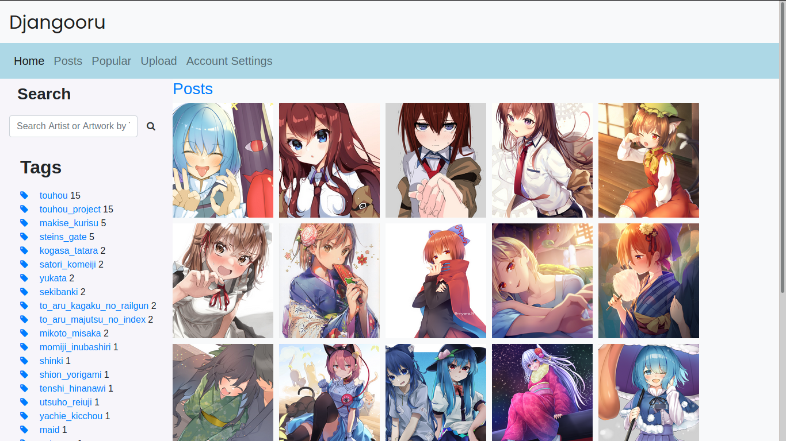

# Djangooru
Danbooru-like taggable image board written in django
### Post View

### Detailed View

## DISCLAIMER!
The images featured in those screenshots aren't mine! See [Image Sources]("imagesources.md") for the sources!

## Installation
1. Clone the repo
2. run `pip install -r requirements.txt` 
3. Install postgresql
4. Create `media` directory under the root dir
5. Create new psql db
6. Set the db in `settings.py`
7. Create a directory called `staticfiles` under the root directory
8. Run `python manage.py collectstatic` 
9. Create two folders called `migrations` in both `posts` and `accounts` directory, and create an empty file called `__init__.py` inside them
10. Run `python manage.py migrate`
11. Run `python manage.py makemigrations`
12. Run `python manage.py migrate` again
13. Run `python manage.py runserver` and everything is ready. You can test it

## TO-DOs
- ~~Make the tags query params, not paths~~ (Actually both)
- ~~Make the search bar works~~
- ~~Make the search bar works __Globally__~~
- ~~Create better design (I'd be really happy if someone could contribute to this)~~ (Almost done thanks to [this guy](https://github.com/DaNoobBoii) :) )
- Make next/before on post detail works with tags
- Responsive grid
- API with djangorestframework
